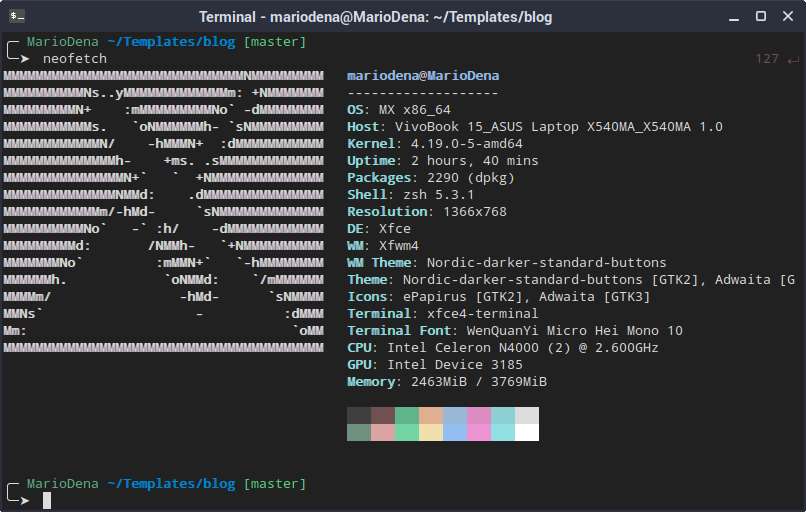

# MDmini
A simple theme to use with oh-my-zsh

### Usage

This is a theme for oh-my-zsh framework for your zsh terminal the Z shell.
In order to use it you need to install zsh.

You can do it using your package manager like `sudo apt install zsh` 
To install oh-my-zsh refer to the official website https://ohmyz.sh/

Just drag and drop this theme into `~/.oh-my-zsh/themes/`

Set the name of your theme in your `~/.zshrc` file to: MDmini

The font used in the screenshot is WenQuanYi Micro Hei Mono 10.
